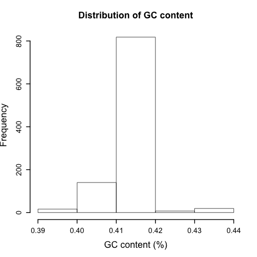
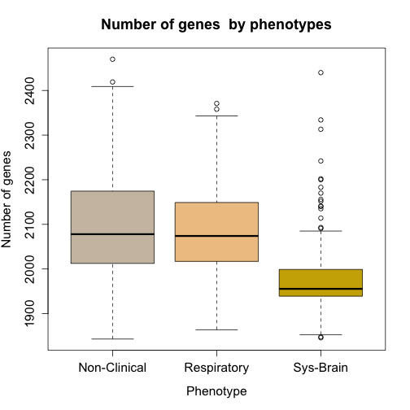
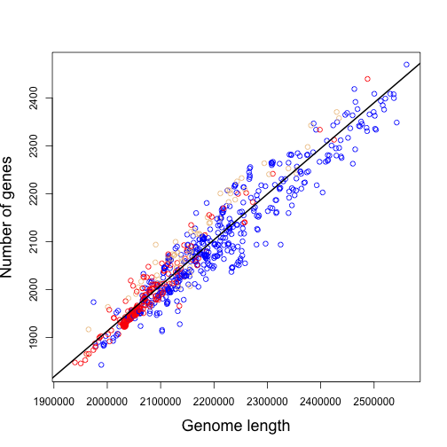
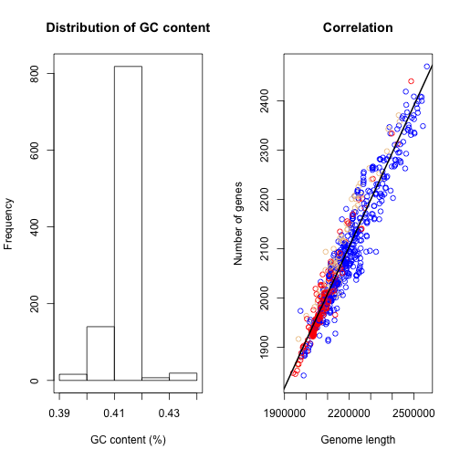

  
## Graphical analysis in R 
<br></br>
**Mukarram Hossain**
<br></br>
Department of Veterinary Medicine  
University of Cambridge
<br></br>
7 October, 2019

---
  
### Introduction
  
- Graphs are a powerful way to present data and results in a concise manner.
- Graphs are more readily understandable than words and numbers.
- Good graphs are useful in examining data to get idea about the patterns that may exist.
- Graphs can also aid in selecting correct statistical analysis.
<br></br>
`R has powerful and flexible graphical capabilities.`

---

### Graphical analysis in R

- Graphical analysis in R is done by calling a series of graphics functions.
- These functions produce either:
    - a complete plot, or
    - adds some output to an existing plot.
- R graphics follows a **painter's model**.
- Sophisticated packages are developed *e.g.* `ggplot2`.

---

## Analysis of a bacterial dataset using R

---

### The dataset

- Our dataset for today contains information about bacterial whole genome sequences.
- For each bacterial strains we have the following features:
    - Country of isolation
    - Population group
    - Phenotype
    - Genome length
    - Percentage of GC content
    - No. of coding sequences

---

### The dataframe 


```r
strainInfo <- read.csv('dataset.csv', header = T, quote = "", na.strings = "?")

head(strainInfo,10)
```

```
##      Strain Country GenomeSize    Phenotype Population  CDS     GC
## 1   Strain1  Canada    2098424 Non-Clinical          1 1993 0.4106
## 2   Strain2  Canada    2099479 Non-Clinical          1 1993 0.4106
## 3   Strain3  Canada    2133605         <NA>          1 2070 0.4108
## 4   Strain4      UK    2143407         <NA>          1 2053 0.4097
## 5   Strain5      UK    2144506         <NA>          1 2049 0.4097
## 6   Strain6  Canada    2145656    Sys-Brain          1 2065 0.4105
## 7   Strain7  Canada    2149163    Sys-Brain          1 2082 0.4097
## 8   Strain8  Canada    2151107    Sys-Brain          1 2085 0.4100
## 9   Strain9      UK    2155971  Respiratory          1 2080 0.4095
## 10 Strain10  Canada    2156465  Respiratory          1 2089 0.4103
```


---

### Strains by Country of isolation (Pie chart)


```r
pie.data <- table(strainInfo$Country)
lbls <- paste(names(pie.data), "\n", pie.data, sep="")
pie(pie.data, labels = lbls, cex = 1.5, cex.main = 1.5,
   main="Pie Chart of Country\n (with number of strains)")
```


---  


### Distribution of GC content (Histogram)


```r
hist(strainInfo$GC, breaks = 5, cex = 1.5,
     main = 'Distribution of GC content',
     xlab = 'GC content (%)', lwd = 2,
     cex.lab = 1.5, cex.main = 1.5, cex.axis = 1.2)
```



---
  
### Disease causing strains have fewer genes?? (Boxplot)


```r
boxplot(strainInfo$CDS ~ strainInfo$Phenotype, cex.lab = 1.3, cex.main = 1.5, cex.axis = 1.3,
        ylab='Number of genes', xlab='Phenotype',
        main='Number of genes  by phenotypes', col=c("antiquewhite3","burlywood2","gold3"))
```



---

### Systemic strains have fewer genes (Violin plot)


```r
vioplot(x1, x2, x3, cex.lab = 1.3, cex.main = 1.5, cex.axis = 1.3, 
        names=c("Non-Clinical","Respiratory","Sys-Brain"),
        col=c("antiquewhite3","burlywood2","gold3"),main='Number of genes by phenotypes')
```

```
## [1] 1843 2470
```


---

### Genome length is correlated with number of genes (Scatter plot)


```r
plot(strainInfo$GenomeSize,strainInfo$CDS, cex.lab = 1.5,
     col = c("blue","burlywood2","red")[strainInfo$Phenotype],
     xlab = 'Genome length', ylab = 'Number of genes')
abline(lm(strainInfo$CDS ~ strainInfo$GenomeSize), col = 'black', lwd = 2)
```




---

### Bacterial population structure and phenotypes (Stacked barplot)


```r
counts <- table(strainInfo$Phenotype,strainInfo$Population)
barplot(counts, main = "Distribution of strains", cex.lab = 1.5,
        xlab = "Bacterial population", cex.main = 1.5,
        ylab = 'Number of strains', legend = rownames(counts))
abline(h = 0)
```


---

### Multiple plots in a grid




---

### Multiple plots in a grid (R code)


```r
par(mfrow=c(1,2))

hist(strainInfo$GC, breaks = 5,
     main = 'Distribution of GC content',
     xlab = 'GC content (%)')

box()

plot(strainInfo$GenomeSize,strainInfo$CDS,
     col = c("blue","burlywood2","red")[strainInfo$Phenotype],
     xlab = 'Genome length', ylab = 'Number of genes',
     main = 'Correlation')

abline(lm(strainInfo$CDS ~ strainInfo$GenomeSize), col = 'black', lwd = 2)
```

---

### Saving plots in files (R code)


```r
png('MyImage.png')

par(mfrow=c(1,2))

hist(strainInfo$GC, breaks = 5,
     main = 'Distribution of GC content',
     xlab = 'GC content (%)')

box()

plot(strainInfo$GenomeSize,strainInfo$CDS,
     col = c("blue","burlywood2","red")[strainInfo$Phenotype],
     xlab = 'Genome length', ylab = 'Number of genes',
     main = 'Correlation')

abline(lm(strainInfo$CDS ~ strainInfo$GenomeSize), col = 'black', lwd = 2)

dev.off()
```

```
## quartz_off_screen 
##                 2
```

---

### Summary

- R is a free, open source platform for statistical and graphical analysis.
- Scripts written in R can run on Windows, Linux and Mac OS X.
- Graphs produced by R are reproducible.
- R has a large user space.

---

### Additional websites

- Cookbook for R  - http://www.cookbook-r.com
- The Comprehensive R Archive network (CRAN) - https://cran.r-project.org
- R Bloggers - http://r-bloggers.com
- ggplot2 documentation - https://ggplot2.tidyverse.org/reference/

---

## Thank you !!
